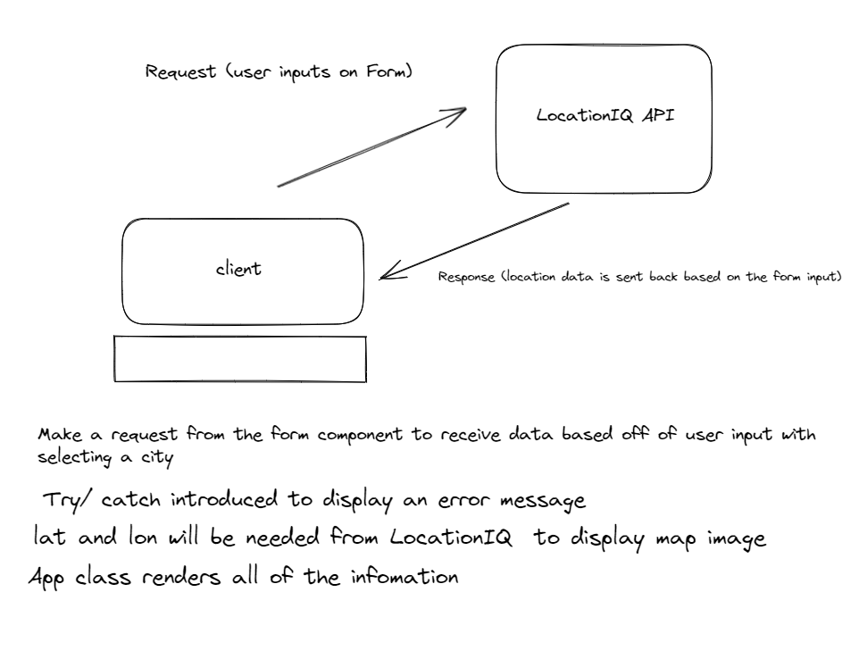

# City Explorer

**Author**: DaJon Ewing

**Version**: 2.0.0 (increment the patch/fix version number if you make more commits past your first submission)

## Overview
This app allows a user to enter a city name into the form and it will display the city's latitude and longitude and map of the area.

## Getting Started
1.Enter a city name in the search field and click the "Explore!" button.

2.The app will display the city name, latitude, and longitude, along with a map of the city.

## Architecture

- React was utilized to set up the webpage
- Being deployed through Netlify
- Bootstrap is being imported for design purposes
- Using LocationIQ to pull city data
- Axios is being used to connect to API(s)

## Change Log
<!-- Use this area to document the iterative changes made to your application as each feature is successfully implemented. Use time stamps. Here's an example:

03-22-20 23 4:07pm - Application now has a fully-functional express server, with a GET route for the location resource. -->

## Credit and Collaborations

Name of feature: Connected back-end to front-end

Estimate of time needed to complete: 2hrs

Start time: _____

Finish time: _____

Actual time needed to complete: 2hrs